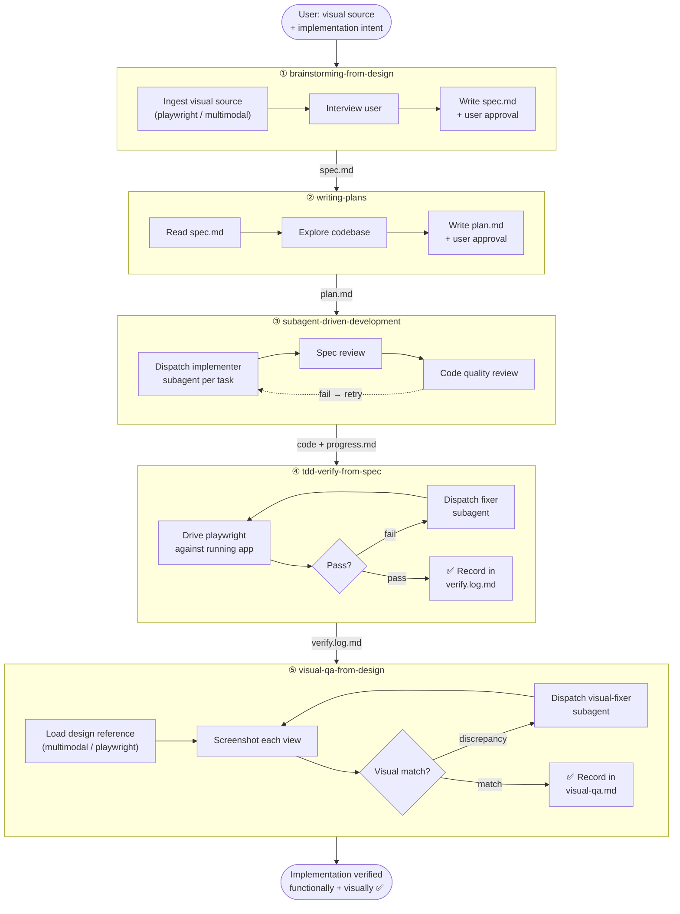

# design-to-code

A Claude Code plugin that turns any visual source (design URL, attached image, or an already-rendered page) plus explicit implementation intent into a verified, pixel-faithful implementation — through a 5-stage, linear, spec-driven workflow.

---

## Workflow



### How each stage works

| # | Skill | What it does | Consumes | Produces |
|---|-------|-------------|----------|----------|
| 1 | `brainstorming-from-design` | Opens design in playwright or reads images multimodally; interviews you question-by-question; writes a user-approved spec | URL / image / in-project page | `spec.md` |
| 2 | `writing-plans` | Explores the codebase, decomposes the spec into subagent-sized tasks with explicit file lists and acceptance criteria | `spec.md` | `plan.md` |
| 3 | `subagent-driven-development` | Dispatches a fresh implementer subagent per task; each task passes spec-review then code-quality-review before moving on | `plan.md` | code + `progress.md` |
| 4 | `tdd-verify-from-spec` | Drives playwright against the running app; checks every acceptance item from spec.md; dispatches fixer subagents on failures | `spec.md` + running app | `verify.log.md` |
| 5 | `visual-qa-from-design` | Screenshots each view, compares multimodally against the original design source, dispatches visual-fixer subagents for pixel-level gaps | `spec.md` design source + running app | `visual-qa.md` |

### Artifacts

All files land under `docs/design-to-code/<YYYY-MM-DD>-<topic>/` in your project:

```
docs/design-to-code/2025-06-01-cart-empty-state/
├── spec.md          ← stage 1 (user-approved; never edited by assistant afterward)
├── plan.md          ← stage 2
├── progress.md      ← stage 3 (one entry per task)
├── verify.log.md    ← stage 4 (one entry per acceptance item)
├── visual-qa.md     ← stage 5 (one entry per view)
└── screenshots/     ← stage 5 screenshots
```

No skill writes into another skill's artifact.

---

## Trigger

The plugin activates when a single message contains **both**:

1. A visual source — a design URL, an image attachment, or a reference to an existing page/component in the current project, **and**
2. Explicit implementation intent — "实现", "做出来", "还原", "照这个写", "implement this", "build this", "extend this page".

Only one of the two conditions? Claude will ask before entering the workflow.

---

## Skipping to a later stage

If upstream artifacts already exist, jump in directly:

```
Have spec.md already?     → invoke design-to-code:writing-plans
Have plan.md already?     → invoke design-to-code:subagent-driven-development
Re-verify existing build? → invoke design-to-code:tdd-verify-from-spec
Re-run visual QA only?    → invoke design-to-code:visual-qa-from-design
```

---

## Installation

### Prerequisites

- [Claude Code](https://claude.ai/code) with the [superpowers](https://github.com/superpowers-ai/superpowers) plugin installed (provides the `Skill` tool)
- `node >= 18` on the host (playwright is auto-installed by stages 1, 4, and 5 if missing)

### Option A — Direct skills install (recommended, no plugin wrapper)

Copy the skills directly into your project's `.claude/skills/` directory. No `plugin.json` needed; superpowers discovers skill folders from `.claude/skills/` automatically.

```bash
# inside your project root
git submodule add https://github.com/tianweizhang/design-to-code \
  .claude/skills/design-to-code
git commit -m "chore: add design-to-code skills"
```

Or copy without submodule (no version tracking):

```bash
cp -r /path/to/design-to-code/skills/. .claude/skills/
```

Resulting structure in your project:

```
.claude/
└── skills/
    ├── brainstorming-from-design/
    │   └── SKILL.md
    ├── writing-plans/
    │   └── SKILL.md
    ├── subagent-driven-development/
    │   ├── SKILL.md
    │   └── *.md
    ├── tdd-verify-from-spec/
    │   ├── SKILL.md
    │   └── *.md
    └── visual-qa-from-design/
        ├── SKILL.md
        └── visual-fixer-prompt.md
```

Invoke any skill by name, e.g. `design-to-code:brainstorming-from-design` — or just send Claude a message with a design source and implementation intent and it will trigger automatically.

To upgrade later:

```bash
cd .claude/skills/design-to-code
git pull origin master
cd -
git add .claude/skills/design-to-code
git commit -m "chore: upgrade design-to-code skills"
```

### Option B — Global plugin install

Install once and have it available in every project:

```bash
git clone https://github.com/tianweizhang/design-to-code \
  ~/.claude/plugins/local/design-to-code
```

### Option C — Project-scoped plugin install

Pin the plugin version inside the repo so the whole team gets it:

```bash
git submodule add https://github.com/tianweizhang/design-to-code \
  .claude/plugins/local/design-to-code
git commit -m "chore: add design-to-code plugin"
```

Team members run `git submodule update --init --recursive` to pull it down.

---

> **Which option?**
> - **A** — you want the skills scoped to this repo, no plugin infrastructure, simplest to reason about.
> - **B** — you use these skills across many projects and don't want per-repo setup.
> - **C** — same as A but you prefer the plugin namespace (`design-to-code:skill-name`) and want `plugin.json` metadata available.

### Verify discovery

Open Claude Code in the project and run:

```
/plugins
```

You should see the skills listed. If not, check that the directory contains `SKILL.md` files at the expected paths.

### Use it

Send Claude a message with a design source and intent, for example:

```
Here's the Figma link for the new checkout page: https://figma.com/...
Implement it.
```

Claude will announce `"I'm using the brainstorming-from-design skill…"` and walk you through the workflow.

---

## Troubleshooting

| Symptom | Fix |
|---------|-----|
| Playwright install fails | Run `npm install -g @playwright/cli@latest` manually; ensure node ≥ 18 |
| Login session lost between verifications | Confirm the browser was opened with `--headed --persistent`; non-persistent sessions lose cookies |
| Fixer loops without converging (stage 4) | Skill pauses at 5 rounds and reports; treat this as a signal to redesign the acceptance item or split it |
| Visual-fixer loops without converging (stage 5) | Skill pauses at 3 rounds and reports; check whether the design reference is clear enough to derive an exact value |
| Plugin not discovered | Ensure `~/.claude/plugins/local/design-to-code/plugin.json` exists and superpowers is installed |

---

## Relationship to superpowers

Inspired by superpowers conventions (subagent-driven-development, test-driven-development, writing-plans) but **self-contained** at runtime. No skill references `superpowers:*` internally.
