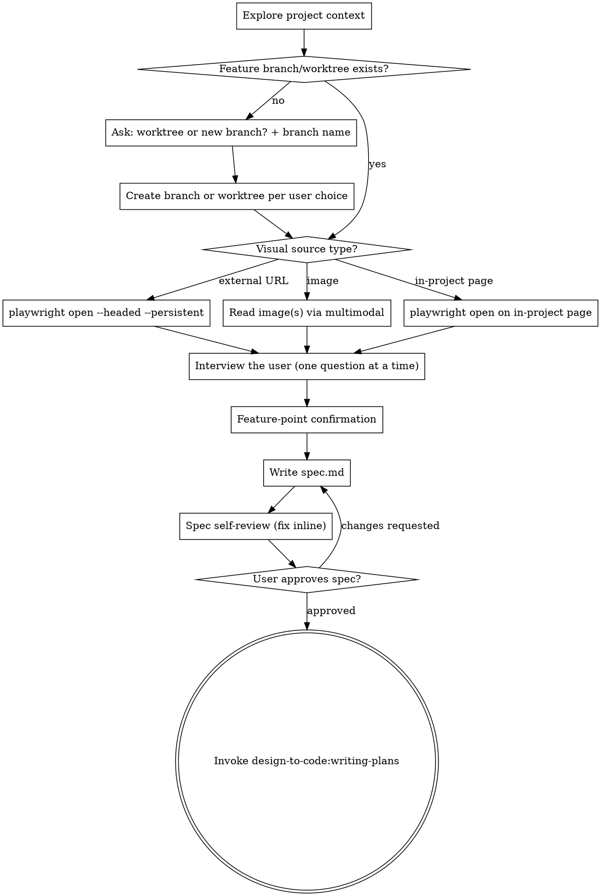

# Brainstorming from Design

Transform any visual source into a user-approved `spec.md`, then hand off to `design-to-code:writing-plans`. This skill is the **entry point** of the 4-stage `design-to-code` workflow and owns the "visual source → spec" stage only; no code is written here.

A "visual source" is anything the assistant can read through playwright or multimodally:

- External design URL (Figma public link, design tool export page, staging site, etc.)
- One or more image attachments (screenshot, photo of a whiteboard, exported PNG)
- A page already rendered by the current project (user says "扩展这个页面", "照着这个组件再做一个")
- A combination of the above (multiple images + a reference page)

**Announce at start:** "I'm using the brainstorming-from-design skill to turn this design into a spec."

<HARD-GATE>
Do NOT write any implementation code, dispatch implementer subagents, or invoke `design-to-code:writing-plans` until `spec.md` has been written and the user has explicitly approved it. Even for visually simple designs.
</HARD-GATE>

## The 5-Stage Workflow

This plugin runs five skills in order. Each produces a single artifact that the next consumes:

1. `design-to-code:brainstorming-from-design` — design → `spec.md` (this skill)
2. `design-to-code:writing-plans` — `spec.md` → `plan.md`
3. `design-to-code:subagent-driven-development` — `plan.md` → implementation + `progress.md`
4. `design-to-code:tdd-verify-from-spec` — drive playwright to verify `spec.md` acceptance items → `verify.log.md`
5. `design-to-code:visual-qa-from-design` — screenshot implementation and compare against original design → `visual-qa.md`

Users may skip to a later skill when upstream artifacts already exist (have `spec.md` → jump to `writing-plans`; have `plan.md` → jump to `subagent-driven-development`).

## Language

`spec.md` MUST be written entirely in Chinese (Simplified). This applies to all section headings, feature descriptions, acceptance checklist items, and notes. Code identifiers, file paths, and proper nouns (framework names, library names) remain in their original form.

## Shared Discipline (applies to every skill in this plugin)

- Internal references MUST use `design-to-code:<skill-name>`. References to `superpowers:*` are forbidden within this plugin.
- Artifact directory: `docs/design-to-code/<YYYY-MM-DD>-<topic>/`. Filenames are fixed: `spec.md`, `plan.md`, `progress.md`, `verify.log.md`.
- `spec.md` is immutable to the assistant; only the user may edit it. `plan.md` is written only by `design-to-code:writing-plans`. `progress.md` is appended only by `design-to-code:subagent-driven-development`. `verify.log.md` is written only by `design-to-code:tdd-verify-from-spec`. No skill writes into another skill's artifact.
- Do not write artifact files on `main` / `release`. A feature branch or worktree must exist first.
- **Upstream-artifact defects: the user is the only valid trigger for rework.** If a downstream skill finds that `spec.md` or `plan.md` is wrong, contradictory, or missing something load-bearing, it MUST stop and report to the user. The downstream skill MUST NOT edit the upstream artifact itself. Once the user revises `spec.md` (or asks to re-run `design-to-code:writing-plans`), all downstream artifacts built from the old version are considered invalid and must be rebuilt.

## Activation

When both (a) the user's message references a visual source the assistant can read (URL, image attachment, or a page in the current project) AND (b) the message expresses implementation or extension intent, proceed with the Checklist below. Do not ask whether to enter the workflow — the two conditions are the entry contract.

When only one of the two conditions is present, ask the user whether they want to enter the workflow. Do not auto-proceed.

## Checklist

You MUST create a task for each of these items and complete them in order:

1. **Explore project context** — read `CLAUDE.md`, recent commits, related feature directories; identify framework stack.
2. **Ensure a feature worktree/branch exists** — never write artifact files on `main`/`release`. If the current branch is already a feature branch, skip. Otherwise follow the procedure in "Feature branch / worktree setup" below.
3. **Ingest visual source** — playwright (URL or in-project page), multimodal image read (image attachment), or both. See the Ingest section below.
4. **Interview the user** — ask one question at a time using the protocol in the Interview section below. Prefer codebase exploration over asking.
5. **Feature-point confirmation** — summarize understood feature points as bullets; user confirms or corrects each.
6. **Write `spec.md`** to `docs/design-to-code/<YYYY-MM-DD>-<topic>/spec.md` with the fixed section set.
7. **Spec self-review** — inline scan for placeholders, contradictions, scope drift, ambiguity; fix inline.
8. **User reviews written spec** — `Read` the file into the conversation; wait for explicit approval. If changes requested, return to step 6.
9. **Hand off** — invoke `design-to-code:writing-plans`, passing the `spec.md` path.

## Process Flow

**The terminal state is invoking `design-to-code:writing-plans`.** Do NOT invoke any implementation skill or write production code from this skill.

## The Process

**Feature branch / worktree setup (Checklist step 2):**

If the current branch is already a feature branch (not `main` / `master` / `release` / etc.), skip this section.

Otherwise, do not auto-create anything. Ask the user two questions in succession:

1. **Isolation mode** — "Do you want to work in a new git worktree (isolated working copy) or just create a new branch on the current working copy?" Provide a recommended answer based on signals in the project (if there is already a `.claude/worktrees/` directory or the user has used worktrees before, recommend worktree; otherwise recommend a new branch).
2. **Branch name** — propose one concrete branch name derived from the visual source (e.g., `feature/cart-empty-state`, `feature/project-settings-export`). Ask the user to confirm or overwrite.

Only after both answers are in, create the worktree (via `git worktree add`) or the branch (`git checkout -b`) and switch to it. Do not write any artifact files before the switch succeeds.

**Ingest visual source:**

- **External design URL:**
  - Run `playwright --version`; on failure, `npm install -g @playwright/cli@latest`.
  - Run `playwright open <url> --headed --persistent`. Headed + persistent are REQUIRED; without them login cannot be carried across sessions.
  - Prompt the user to finish any login flow in the opened browser before continuing.
  - Read the design content via screenshots and DOM inspection.
- **Image attachment(s):** read the image(s) directly using the multimodal capability. Do NOT launch playwright. If multiple images, read them all before starting the interview.
- **In-project page (user wants to extend or mirror an existing page/component):**
  - Locate the relevant files in the codebase first (route, component, related slices).
  - Start the project's dev server if not already running (follow project conventions; ask the user if unclear).
  - Run `playwright open <dev-url> --headed --persistent` and read the current state of the page.
  - During the interview, treat the existing page as the "before" state and clarify what should change.

**Interview the user:**

Interview me relentlessly about every aspect of this plan until we reach a shared understanding. Walk down each branch of the design tree, resolving dependencies between decisions one-by-one. For each question, provide your recommended answer.

Ask the questions one at a time.

If a question can be answered by exploring the codebase, explore the codebase instead.

**Feature-point confirmation:** summarize the understood feature points as bullets; the user confirms or corrects each before spec is written.

## After the Q&A

**Write `spec.md`** at `docs/design-to-code/<YYYY-MM-DD>-<topic>/spec.md`. Required sections:

- **Design source** — URL or image path
- **Feature points** — each with entry, interaction, data
- **Interface impact** — added / modified / none
- **Acceptance checklist** — phrased for playwright verification; each item must have a concrete assertion
- **Non-goals**

**Spec self-review** — inline scan for:

1. Placeholders ("TBD", "TODO", vague requirements)
2. Internal contradictions between sections
3. Scope drift beyond what the user confirmed
4. Ambiguous wording that could be read two ways

Fix inline. No re-review loop; fix and move on.

**User review gate** — `Read` the spec into the conversation and say:

> "Spec written to `<path>`. Please review it and let me know if you want any changes before I hand off to `design-to-code:writing-plans`."

Wait for explicit approval. On changes, return to "Write `spec.md`".

## Key Principles

- **One question at a time** — don't overwhelm with multiple questions.
- **Multiple choice preferred** — easier to answer than open-ended when possible.
- **YAGNI ruthlessly** — remove unnecessary features from the spec.
- **Incremental validation** — confirm each decision branch before moving to the next.
- **Spec is immutable after approval** — downstream skills read it; they cannot modify it.

## Artifacts

- `spec.md` — committed to git by the user's project.

## Integration

**Required workflow skills:**
- **design-to-code:writing-plans** — consumes the `spec.md` this skill produces.

**Downstream skills (for context):**
- **design-to-code:subagent-driven-development** — executes the plan.
- **design-to-code:tdd-verify-from-spec** — verifies functional acceptance items in the running app.
- **design-to-code:visual-qa-from-design** — verifies pixel-level visual fidelity against the original design.
