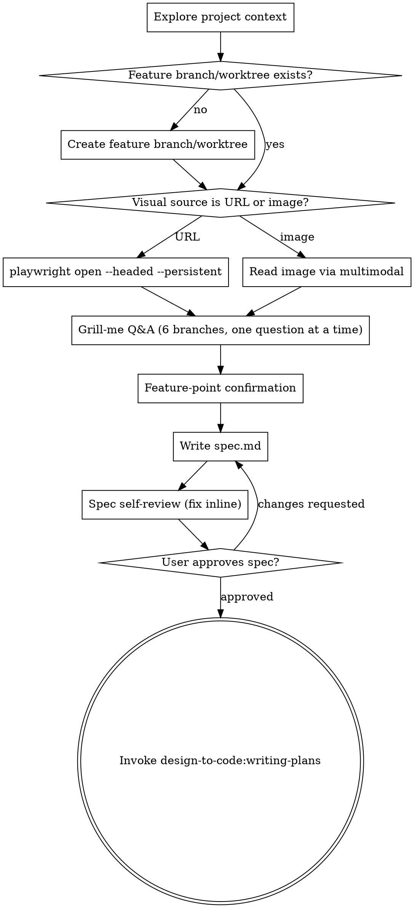

# Brainstorming from Design

Transform a design URL or image into a user-approved `spec.md`, then hand off to `design-to-code:writing-plans`. This skill is the **entry point** of the 4-stage `design-to-code` workflow and owns the "design → spec" stage only; no code is written here.

**Announce at start:** "I'm using the brainstorming-from-design skill to turn this design into a spec."

<HARD-GATE>
Do NOT write any implementation code, dispatch implementer subagents, or invoke `design-to-code:writing-plans` until `spec.md` has been written and the user has explicitly approved it. Even for visually simple designs.
</HARD-GATE>

## The 4-Stage Workflow

This plugin runs four skills in order. Each produces a single artifact that the next consumes:

1. `design-to-code:brainstorming-from-design` — design → `spec.md` (this skill)
2. `design-to-code:writing-plans` — `spec.md` → `plan.md`
3. `design-to-code:subagent-driven-development` — `plan.md` → implementation + `progress.md`
4. `design-to-code:tdd-verify-from-spec` — drive playwright to verify `spec.md` acceptance items → `verify.log.md`

Users may skip to a later skill when upstream artifacts already exist (have `spec.md` → jump to `writing-plans`; have `plan.md` → jump to `subagent-driven-development`).

## Shared Discipline (applies to every skill in this plugin)

- Internal references MUST use `design-to-code:<skill-name>`. References to `superpowers:*` are forbidden within this plugin.
- Artifact directory: `docs/design-to-code/<YYYY-MM-DD>-<topic>/`. Filenames are fixed: `spec.md`, `plan.md`, `progress.md`, `verify.log.md`.
- `spec.md` is immutable to the assistant; only the user may edit it. `plan.md` is written only by `design-to-code:writing-plans`. `progress.md` is appended only by `design-to-code:subagent-driven-development` (exception: `design-to-code:tdd-verify-from-spec` may append a single "verification complete" section at the very end).
- Do not write artifact files on `main` / `release`. A feature branch or worktree must exist first.

## Activation

When both (a) the user's message contains a design URL or image attachment AND (b) the message expresses implementation intent, proceed with the Checklist below. Do not ask whether to enter the workflow — the two conditions are the entry contract.

When only one of the two conditions is present, ask the user whether they want to enter the workflow. Do not auto-proceed.

## Checklist

You MUST create a task for each of these items and complete them in order:

1. **Explore project context** — read `CLAUDE.md`, recent commits, related feature directories; identify framework stack.
2. **Ensure a feature worktree/branch exists** — never write artifact files on `main`/`release`. If no feature branch, create one (or a worktree) before any file write.
3. **Ingest visual source** — playwright (URL) or multimodal image read (image). See the Ingest section below.
4. **Grill-me Q&A** — one question at a time, walking the six mandatory branches. See the Q&A section below.
5. **Feature-point confirmation** — summarize understood feature points as bullets; user confirms or corrects each.
6. **Write `spec.md`** to `docs/design-to-code/<YYYY-MM-DD>-<topic>/spec.md` with the fixed section set.
7. **Spec self-review** — inline scan for placeholders, contradictions, scope drift, ambiguity; fix inline.
8. **User reviews written spec** — `Read` the file into the conversation; wait for explicit approval. If changes requested, return to step 6.
9. **Hand off** — invoke `design-to-code:writing-plans`, passing the `spec.md` path.

## Process Flow

**The terminal state is invoking `design-to-code:writing-plans`.** Do NOT invoke any implementation skill or write production code from this skill.

## The Process

**Ingest visual source:**

- **If a design URL:**
  - Run `playwright --version`; on failure, `npm install -g @playwright/cli@latest`.
  - Run `playwright open <url> --headed --persistent`. Headed + persistent are REQUIRED; without them login cannot be carried across sessions.
  - Prompt the user to finish any login flow in the opened browser before continuing.
  - Read the design content via screenshots and DOM inspection.
- **If an image attachment:** read the image directly using the multimodal capability. Do NOT launch playwright.

**Grill-me Q&A (methodology adapted from mattpocock `grill-me`):**

- One question at a time. Walk the decision tree systematically; later branches may change based on earlier answers.
- Every question carries a recommended answer with rationale.
- Prefer grepping / reading the project over asking the user; only ask for true intent or business judgment.
- Prefer multiple choice over open-ended.
- Do not stop early to save tokens; stop only when understanding is genuinely shared.

**Branches that MUST be covered, in order:**

1. **Interface layer** — new backend endpoints? Existing ones gaining fields or being restructured? Contract source (OpenAPI / already implemented / not yet written)? Backward-compat requirement?
2. **Entry point & location** — which page, route, component hosts the feature? Trigger (button, menu, right-click, URL param, hotkey)? Permission / gating / role constraints?
3. **Interaction details** — loading / empty / error states? Confirm, undo, toast, redirect, inline update?
4. **Data & state** — new state location (Redux slice / local / URL query)? Persistence (redux-persist whitelist)? Concurrency / optimistic update?
5. **i18n / styling** — does copy need zh-CN and en-US? antd theme or `antd-style` custom?
6. **Non-goals** — explicitly confirm what is NOT being built.

After each branch, emit a short summary of that branch and let the user confirm before moving on.

**Feature-point confirmation:** summarize the understood feature points as bullets; the user confirms or corrects each before spec is written.

## After the Q&A

**Write `spec.md`** at `docs/design-to-code/<YYYY-MM-DD>-<topic>/spec.md`. Required sections:

- **Design source** — URL or image path
- **Feature points** — each with entry, interaction, data
- **Interface impact** — added / modified / none
- **Acceptance checklist** — phrased for playwright verification; each item must have a concrete assertion
- **Non-goals**

**Spec self-review** — inline scan for:

1. Placeholders ("TBD", "TODO", vague requirements)
2. Internal contradictions between sections
3. Scope drift beyond what the user confirmed
4. Ambiguous wording that could be read two ways

Fix inline. No re-review loop; fix and move on.

**User review gate** — `Read` the spec into the conversation and say:

> "Spec written to `<path>`. Please review it and let me know if you want any changes before I hand off to `design-to-code:writing-plans`."

Wait for explicit approval. On changes, return to "Write `spec.md`".

## Key Principles

- **One question at a time** — don't overwhelm with multiple questions.
- **Multiple choice preferred** — easier to answer than open-ended when possible.
- **YAGNI ruthlessly** — remove unnecessary features from the spec.
- **Incremental validation** — confirm each grill-me branch before the next.
- **Spec is immutable after approval** — downstream skills read it; they cannot modify it.

## Artifacts

- `spec.md` — committed to git by the user's project.

## Integration

**Required workflow skills:**
- **design-to-code:writing-plans** — consumes the `spec.md` this skill produces.

**Downstream skills (for context):**
- **design-to-code:subagent-driven-development** — executes the plan.
- **design-to-code:tdd-verify-from-spec** — verifies acceptance items in the running app.
