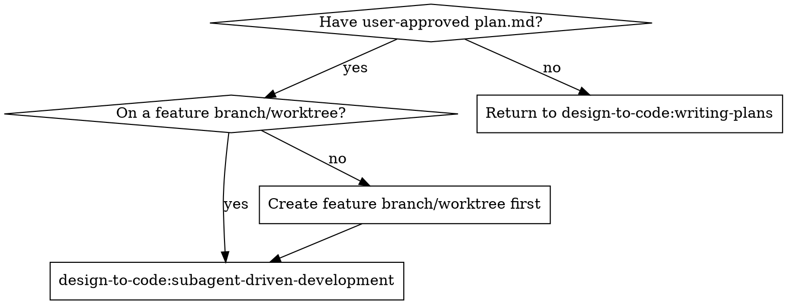
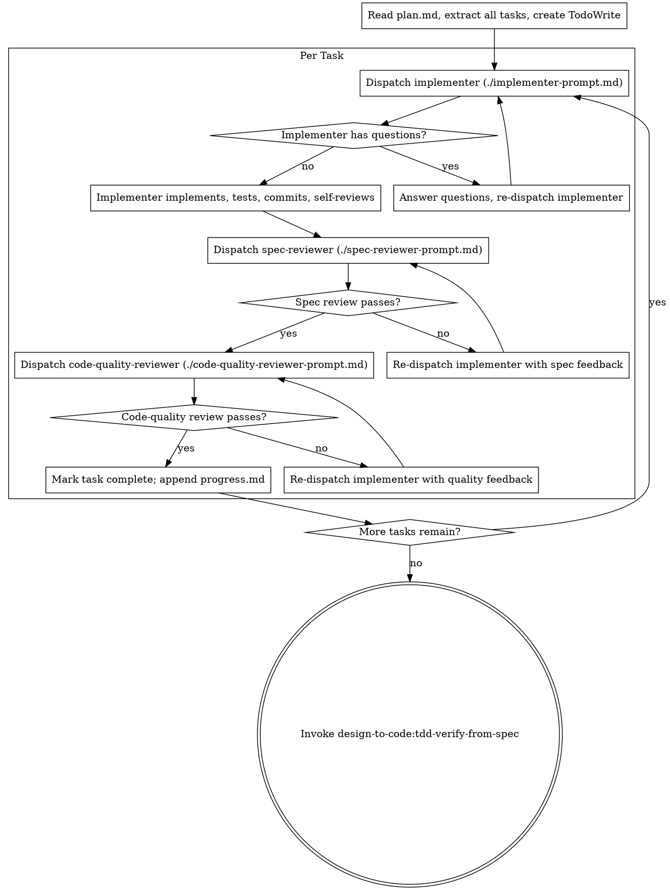

# Subagent-Driven Development

Execute `plan.md` by dispatching a fresh subagent per task, with two-stage review (spec compliance then code quality) after each. The main agent orchestrates; it never edits code directly.

**Why subagents:** You delegate tasks to specialized agents with isolated context. By precisely crafting their instructions, you keep them focused and preserve your own context for coordination. They should never inherit your session's history — construct exactly what they need.

**Core principle:** Fresh subagent per task + two-stage review (spec then quality) = high quality, fast iteration.

**Continuous execution:** Do not pause to check in with the user between tasks. Execute all tasks from the plan without stopping. The only reasons to stop are: BLOCKED status you cannot resolve, ambiguity that genuinely prevents progress, or all tasks complete.

**Announce at start:** "I'm using the subagent-driven-development skill to execute the plan."

## When to Use



## Checklist

You MUST create a task for each of these items and complete them in order:

1. **Read `plan.md` once** — extract every task with full text and Shared Context. The main agent holds this in memory; subagents never read the plan file directly.
2. **Create TodoWrite tasks** — one per plan task, preserving the `Depends on` relationships.
3. **Dispatch implementer subagents task-by-task** — follow the per-task loop in "The Process" below. Parallel dispatch only when `Files` sets don't overlap and `Depends on` is clear.
4. **Per task: pass spec-review, then code-quality-review** — no shortcutting the order.
5. **Append to `progress.md`** after each task completes.
6. **Hand off** — once all tasks are complete, invoke `design-to-code:tdd-verify-from-spec`.

## The Process



## Model Selection

Use the least powerful model that can handle each role to conserve cost and increase speed.

- **Mechanical implementation** (isolated functions, clear specs, 1–2 files): fast, cheap model.
- **Integration and judgment** (multi-file coordination, pattern matching, debugging): standard model.
- **Architecture, design, and review**: most capable available model.

**Task complexity signals:**
- Touches 1–2 files with a complete spec → cheap model.
- Touches multiple files with integration concerns → standard model.
- Requires design judgment or broad codebase understanding → most capable model.

## Handling Implementer Status

Implementer subagents report one of four statuses. Handle each appropriately:

- **DONE**: proceed to spec-review.
- **DONE_WITH_CONCERNS**: read the concerns. If about correctness or scope, address before review. If observations (e.g., "file is getting large"), note and proceed.
- **NEEDS_CONTEXT**: provide the missing context and re-dispatch.
- **BLOCKED**: assess the blocker —
  1. Context problem → provide more context and re-dispatch with the same model.
  2. Needs more reasoning → re-dispatch with a more capable model.
  3. Task too large → break into smaller pieces and revise the plan.
  4. Plan itself is wrong → escalate to the user.

Never ignore an escalation or force the same model to retry without changes.

## Review Loops Have No Round Cap

If a reviewer keeps finding issues, the implementer keeps fixing until the reviewer approves. There is no maximum round count — quality gates do not expire. If a loop feels stuck, the response is to diagnose root cause (task cut too large, plan unclear, wrong model) and adjust, not to time it out.

## Concurrency

Multiple ready tasks (no open `Depends on`) whose `Files` sets do not overlap may be dispatched in parallel — implementers in one message with multiple Agent tool calls. Review stages remain serial to keep feedback tractable.

## Prompt Templates

- `./implementer-prompt.md` — sent to implementer subagents.
- `./spec-reviewer-prompt.md` — sent to spec-compliance reviewer subagents.
- `./code-quality-reviewer-prompt.md` — sent to code-quality reviewer subagents.

## Red Flags

**Never:**
- Main agent edits code directly. All code changes go through an implementer subagent.
- Skip spec-review or code-quality-review.
- Start code-quality review before spec-review has passed (wrong order).
- Move to the next task while either review has open issues.
- Dispatch multiple implementer subagents for the same task (conflicts).
- Make a subagent read `plan.md`; provide the full task text instead.
- Start on `main`/`release` without an explicit user-created feature branch or worktree.

**If a subagent asks questions:** answer clearly and completely before letting them proceed.

**If a reviewer finds issues:** the same implementer subagent fixes, reviewer re-reviews. Repeat until approved. Don't skip re-review.

## Artifacts

- `progress.md` — committed to git by the user's project. Appended per task:

  ```markdown
  ## Task N: <name>
  - Status: completed
  - Implementer rounds: <n>
  - Spec-review rounds: <n>
  - Quality-review rounds: <n>
  - Files changed: <list>
  - Acceptance: ✅ <each item>
  - Notes: <deviations worth recording>
  ```

## Integration

**Required workflow skills:**
- **design-to-code:writing-plans** — produces the `plan.md` this skill executes.
- **design-to-code:tdd-verify-from-spec** — runs after all tasks complete.

**Subagents follow (inside their prompts):**
- TDD discipline per task — failing test first, then the minimal change to make it pass, then commit.
