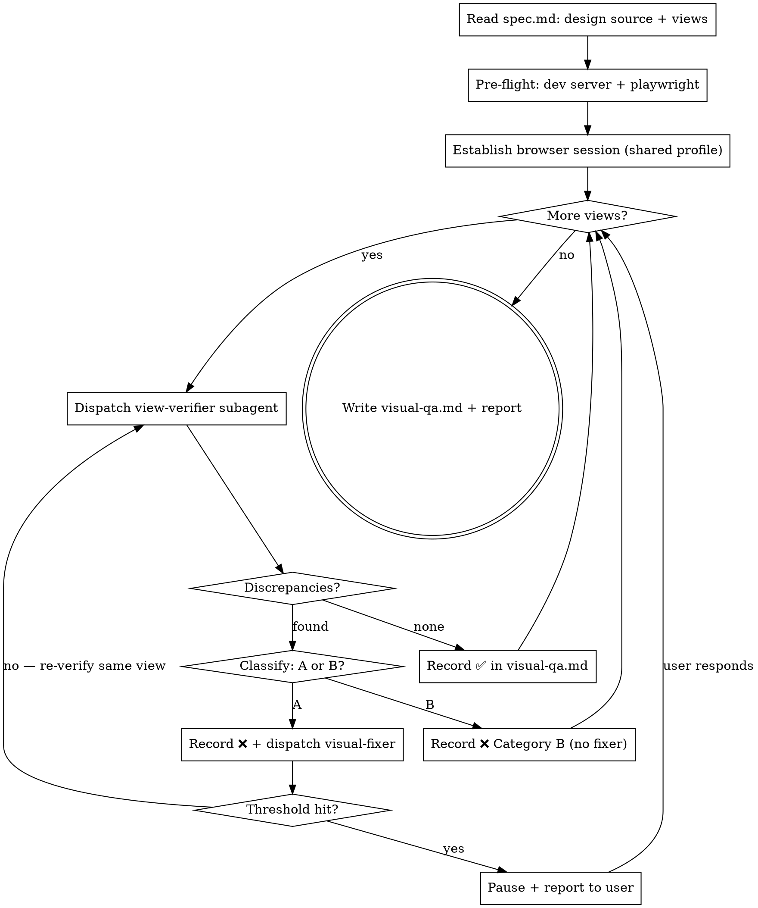

# Visual QA from Design

The main agent orchestrates visual fidelity verification by dispatching one `view-verifier` subagent per view. Each subagent screenshots the running app and compares it multimodally against the original design source. Code-fixable discrepancies dispatch visual-fixer subagents. This is the **terminal skill** of the `design-to-code` workflow.

**Announce at start:** "I'm using the visual-qa-from-design skill to compare the implementation against the original design."

## Plugin-wide discipline (shared HARD-GATE)

- Internal references MUST use `design-to-code:<skill-name>`. References to `superpowers:*` are forbidden.
- Artifact directory is `docs/design-to-code/<YYYY-MM-DD>-<topic>/`. The artifact for this skill is `visual-qa.md`.
- Convert this skill's checklist into TodoWrite tasks and execute in order; no skipping.
- `spec.md` is immutable to the assistant; only the user may edit it.
- Do not write artifact files on `main` / `release`. A feature branch or worktree must exist first.

## Hard gates

- Code fixes MUST go through a visual-fixer subagent; the main agent does not edit code.
- `spec.md` is immutable here. Do NOT weaken or change acceptance items or design references to make comparison pass.
- Every view is recorded as ✅ / ❌ in `visual-qa.md`.
- Every visual failure MUST be classified as Category A (fixable by editing code in the repo) or Category B (not fixable by code: spec ambiguous, design source unavailable/inconclusive, environment/font issue, design intentionally diverged after user decision). The category determines the failure threshold.
- Internal references only `design-to-code:*`.

## Shared playwright profile

All view-verifier subagents use `~/.playwright-profiles/design-to-code` as the persistent profile directory. The login session written during pre-flight is on disk and available to every subagent — no re-login needed.

## Session Bootstrap

When invoked in a fresh session where the `spec.md` path was not passed from a previous skill:

1. Run `find docs/design-to-code -name "spec.md" | sort` to discover existing specs.
2. **One or more results** → list them to the user (show the date-topic directory name for each) and ask which feature to continue with. Wait for the answer before proceeding.
3. **No results** → report that no `spec.md` was found under `docs/design-to-code/`; ask the user to run `design-to-code:brainstorming-from-design` first.

## Checklist

You MUST create a task for each of these items and complete them in order:

1. **Read `spec.md`** — extract the "Design source" field (image path or URL). Identify the views/states to check from "Feature points" and "Acceptance checklist".
2. **Pre-flight** — ensure the dev server is running. Ensure `@playwright/cli` is installed (`npm install -g @playwright/cli@latest` on miss).
3. **Establish browser session** — run once on the main agent: `playwright open <dev-url> --headed --persistent ~/.playwright-profiles/design-to-code`. Prompt user to log in if needed. This writes the session to disk for all view-verifier subagents.
4. **Per-view dispatch loop** — for each identified view, dispatch a `view-verifier` subagent (see "Per-view loop" below).
5. **Write `visual-qa.md`** — record the full results.
6. **Report to user** — summarise overall fidelity, list any unresolved Category B items. This skill is terminal; do not hand off.

## Loading the design reference

The design source is recorded in `spec.md` under "Design source". Pass it as `{{DESIGN_REFERENCE}}` in each view-verifier prompt:

- **Image path(s):** pass the file path directly. The view-verifier subagent reads the image via multimodal capability.
- **External URL (Figma, staging, etc.):** pass the URL. The view-verifier opens it with playwright and takes a screenshot to use as reference. If it requires login, establish that session in pre-flight as well.

If there are multiple images (one per view/state), map each image to the corresponding view.

## Identifying views to check

From `spec.md`, compile a list of views. A "view" is any distinct visual state the user can see:

- A page or route (e.g. `/cart`, `/profile/settings`)
- A component state (e.g. empty list, loading skeleton, filled form, error banner)
- A breakpoint variant the design explicitly shows (mobile / desktop)

Aim to cover every view that has a corresponding design reference image or section. If the design shows only one breakpoint, check only that breakpoint unless the user asks otherwise.

## Per-view loop

For each view, in order:

1. **Determine screenshot output path** — `docs/design-to-code/<YYYY-MM-DD>-<topic>/screenshots/<view-name>.png`.
2. **Dispatch view-verifier subagent** — copy `./view-verifier-prompt.md`, fill all `{{...}}` variables, and dispatch.
3. **When subagent returns:**
   - **PASS**: record ✅ with screenshot path in `visual-qa.md`. Proceed to next view.
   - **FAIL**:
     1. Record ❌ with discrepancy list from subagent return.
     2. **Classify** as Category A or Category B (the subagent includes a suggested classification; use it or override with reasoning).
     3. For **Category A**: dispatch a visual-fixer subagent (`./visual-fixer-prompt.md`). After fixer returns, dispatch a fresh view-verifier for the SAME view.
     4. For **Category B**: record the category and reasoning. Move to the next view.

## Failure classification

- **Category A — code-fixable**: the discrepancy is clearly caused by CSS, component markup, or design tokens in the repo (wrong color value, missing padding class, wrong font-size token, border-radius mismatch, etc.). These are worth fixing automatically.
- **Category B — not code-fixable**: the design source is ambiguous or unavailable for this view; a font is system-specific or not installed; the design was intentionally changed after user approval (user said "that's fine"); or the discrepancy is too subtle to be meaningful (sub-2px rounding, anti-aliasing differences).
- When uncertain, treat as Category B (fail-fast) rather than spawning a fixer for an unverifiable target.

## Failure thresholds

- **Category A**: **3 consecutive rounds** on the same view pauses the loop and reports to the user. Visual issues are harder to converge than functional ones; 3 rounds is the ceiling before escalation.
- **Category B**: **1 round** — record it and move on. Do not retry.
- When a threshold is hit, pause the loop, report the stuck view with evidence to the user, and ask how to proceed. Do not abandon subsequent views; continue after the user responds.

## Process flow



## Prompt files

- `./view-verifier-prompt.md` — template for the view-verifier subagent. Fill `{{VIEW_NAME}}`, `{{VIEW_URL}}`, `{{PLAYWRIGHT_PROFILE_PATH}}` (use `~/.playwright-profiles/design-to-code`), `{{DEV_URL}}`, `{{DESIGN_REFERENCE}}`, and `{{SCREENSHOT_PATH}}` before dispatching.
- `./visual-fixer-prompt.md` — sent to visual-fixer subagents (Category A failures only).

## Artifacts

`visual-qa.md` (committed to git). Per-view entry:

```markdown
## View N: <name>
- Screenshot: <relative path>
- Design reference: <image path or URL>
- Attempts: <count>
- Result: ✅ / ❌
- Category (only on ❌): A (code-fixable) / B (not code-fixable)
- Category reasoning (only on ❌): <one-line justification>
- Discrepancies (only on ❌):
  - Layout: <description or "none">
  - Spacing: <description or "none">
  - Color: <description or "none">
  - Typography: <description or "none">
  - Shape: <description or "none">
  - Copy: <description or "none">
- Fixes applied: <files changed by fixer, or "none">
```

## Integration

**Required workflow skills (upstream):**
- **design-to-code:tdd-verify-from-spec** — runs before this skill; verifies functional acceptance items.

This skill is **terminal**. It does not hand off to any downstream skill.
