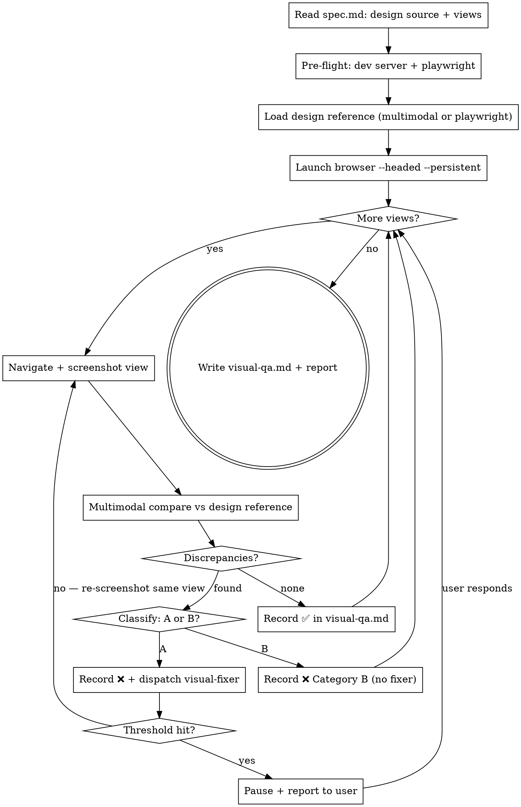

# Visual QA from Design

The main agent drives playwright-cli to screenshot the running app, then compares each screenshot multimodally against the original design source from `spec.md`. Visual discrepancies dispatch visual-fixer subagents. This is the **terminal skill** of the `design-to-code` workflow.

**Announce at start:** "I'm using the visual-qa-from-design skill to compare the implementation against the original design."

## Plugin-wide discipline (shared HARD-GATE)

- Internal references MUST use `design-to-code:<skill-name>`. References to `superpowers:*` are forbidden.
- Artifact directory is `docs/design-to-code/<YYYY-MM-DD>-<topic>/`. The artifact for this skill is `visual-qa.md`.
- Convert this skill's checklist into TodoWrite tasks and execute in order; no skipping.
- `spec.md` is immutable to the assistant; only the user may edit it.
- Do not write artifact files on `main` / `release`. A feature branch or worktree must exist first.

## Hard gates

- playwright-cli MUST be driven by the main agent (browser session must stay on the main agent's instance for screenshot continuity).
- Code fixes MUST go through a visual-fixer subagent; the main agent does not edit code.
- `spec.md` is immutable here. Do NOT weaken or change acceptance items or design references to make comparison pass.
- Every view is recorded as ✅ / ❌ in `visual-qa.md`.
- Every visual failure MUST be classified as Category A (fixable by editing code in the repo) or Category B (not fixable by code: spec ambiguous, design source unavailable/inconclusive, environment/font issue, design intentionally diverged after user decision). The category determines the failure threshold.
- Internal references only `design-to-code:*`.

## Session Bootstrap

When invoked in a fresh session where the `spec.md` path was not passed from a previous skill:

1. Run `find docs/design-to-code -name "spec.md" | sort` to discover existing specs.
2. **One or more results** → list them to the user (show the date-topic directory name for each) and ask which feature to continue with. Wait for the answer before proceeding.
3. **No results** → report that no `spec.md` was found under `docs/design-to-code/`; ask the user to run `design-to-code:brainstorming-from-design` first.

## Checklist

You MUST create a task for each of these items and complete them in order:

1. **Read `spec.md`** — extract the "Design source" field (image path or URL). Identify the views/states to check from "Feature points" and "Acceptance checklist".
2. **Pre-flight** — ensure the dev server is running. Ensure `@playwright/cli` is installed (`npm install -g @playwright/cli@latest` on miss).
3. **Load design reference** — read the original design into your context (see "Loading the design reference" below).
4. **Launch browser** — `playwright open <dev-url> --headed --persistent`. Prompt user to log in if needed.
5. **Per-view visual comparison loop** — for each identified view, screenshot and compare (see "Per-view loop" below).
6. **Write `visual-qa.md`** — record the full results.
7. **Report to user** — summarise overall fidelity, list any unresolved Category B items. This skill is terminal; do not hand off.

## Loading the design reference

The design source is recorded in `spec.md` under "Design source". Two cases:

- **Image path(s):** Read the image(s) directly using multimodal capability. Hold the visual in context for subsequent comparisons. If there are multiple images (one per view/state), map each image to the corresponding view.
- **External URL (Figma, staging, etc.):** Open the URL in a separate browser window (you may reuse the persistent session) and take a full-page screenshot. Use that screenshot as the reference. If it requires login, prompt the user to authenticate in the opened browser.

Keep the design reference image(s) in active context throughout the comparison loop — do not re-read them for every view.

## Identifying views to check

From `spec.md`, compile a list of views. A "view" is any distinct visual state the user can see:

- A page or route (e.g. `/cart`, `/profile/settings`)
- A component state (e.g. empty list, loading skeleton, filled form, error banner)
- A breakpoint variant the design explicitly shows (mobile / desktop)

Aim to cover every view that has a corresponding design reference image or section. If the design shows only one breakpoint, check only that breakpoint unless the user asks otherwise.

## Per-view loop

For each view, in order:

1. **Navigate** to the view in the persistent browser. Trigger any state needed (e.g. empty cart, logged-out).
2. **Screenshot** — capture the full viewport. Save to `docs/design-to-code/<YYYY-MM-DD>-<topic>/screenshots/<view-name>.png`. If a scroll is needed (long page), capture above-the-fold first; note below-the-fold as a separate sub-view.
3. **Compare** — visually inspect the screenshot against the design reference using multimodal reasoning. Check these dimensions in order:
   - **Layout & structure**: element positions, stacking, alignment, grid/flex structure
   - **Spacing**: margins, paddings, gaps between elements
   - **Color & contrast**: background, text color, border color, icon fill
   - **Typography**: font family, weight, size, line-height, letter-spacing
   - **Component shape**: border-radius, shadow, icon shape/size
   - **Content & copy**: placeholder text, labels, button text (if spec confirms exact copy)
4. **Record** the result in `visual-qa.md`:
   - On **pass** (no meaningful discrepancies): ✅ with screenshot path.
   - On **fail**: ❌ with screenshot path, a bullet list of discrepancies, and classification (see below).
5. **Category A failures** → dispatch a visual-fixer subagent (`./visual-fixer-prompt.md`). After fixer returns, wait briefly for HMR if applicable, take a fresh screenshot, and re-compare. Re-run the SAME view — do not advance to the next one.
6. **Category B failures** → do NOT dispatch a fixer. Record the category and reasoning. Move to the next view.

## Failure classification

- **Category A — code-fixable**: the discrepancy is clearly caused by CSS, component markup, or design tokens in the repo (wrong color value, missing padding class, wrong font-size token, border-radius mismatch, etc.). These are worth fixing automatically.
- **Category B — not code-fixable**: the design source is ambiguous or unavailable for this view; a font is system-specific or not installed; the design was intentionally changed after user approval (user said "that's fine"); or the discrepancy is too subtle to be meaningful (sub-2px rounding, anti-aliasing differences).
- When uncertain, treat as Category B (fail-fast) rather than spawning a fixer for an unverifiable target.

## Failure thresholds

- **Category A**: **3 consecutive rounds** on the same view pauses the loop and reports to the user. Visual issues are harder to converge than functional ones; 3 rounds is the ceiling before escalation.
- **Category B**: **1 round** — record it and move on. Do not retry.
- When a threshold is hit, pause the loop, report the stuck view with evidence to the user, and ask how to proceed. Do not abandon subsequent views; continue after the user responds.

## Process flow



## Prompt file

- `./visual-fixer-prompt.md` — sent to visual-fixer subagents (Category A failures only)

## Artifacts

`visual-qa.md` (committed to git). Per-view entry:

```markdown
## View N: <name>
- Screenshot: <relative path>
- Design reference: <image path or URL>
- Attempts: <count>
- Result: ✅ / ❌
- Category (only on ❌): A (code-fixable) / B (not code-fixable)
- Category reasoning (only on ❌): <one-line justification>
- Discrepancies (only on ❌):
  - Layout: <description or "none">
  - Spacing: <description or "none">
  - Color: <description or "none">
  - Typography: <description or "none">
  - Shape: <description or "none">
  - Copy: <description or "none">
- Fixes applied: <files changed by fixer, or "none">
```

## Integration

**Required workflow skills (upstream):**
- **design-to-code:tdd-verify-from-spec** — runs before this skill; verifies functional acceptance items.

This skill is **terminal**. It does not hand off to any downstream skill.
