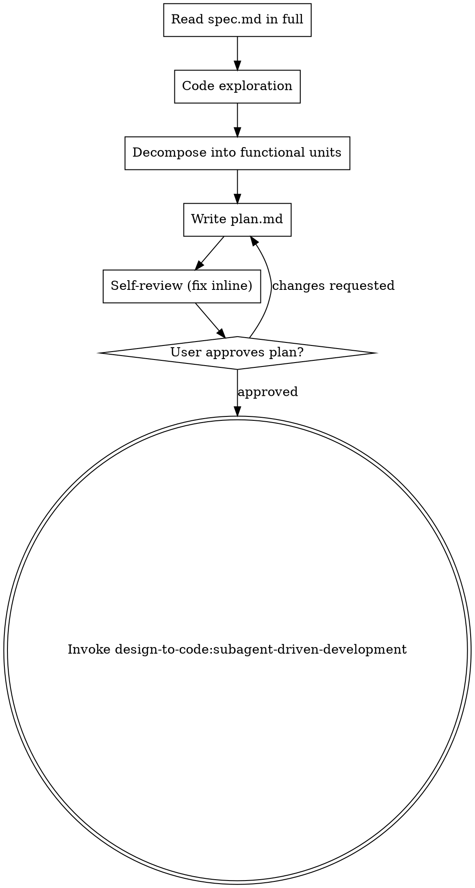

# Writing Plans

## Overview

Turn an approved `spec.md` into an implementation `plan.md`, decomposed into functional units that each a single subagent can deliver. Assume the implementer is a skilled engineer who knows nothing about this codebase, so the plan must be precise about files, boundaries, and completion criteria. DRY. YAGNI. TDD. Frequent commits.

This skill writes documentation only; no production code.

**Announce at start:** "I'm using the writing-plans skill to turn the spec into an implementation plan."

**Save plans to:** `docs/design-to-code/<YYYY-MM-DD>-<topic>/plan.md` (co-located with `spec.md`).

## Scope Check

If `spec.md` covers multiple independent subsystems that don't share an acceptance surface, stop and ask the user to return to `design-to-code:brainstorming-from-design` to split the spec. One `plan.md` should produce one shippable, verifiable feature.

Do NOT regenerate or duplicate the acceptance checklist. `spec.md` is the single source of truth for acceptance; `plan.md` describes which acceptance a task covers semantically, and never copies or quotes the spec's wording.

## File Structure

Before defining tasks, map out which files will be created or modified and what each one owns. This is where decomposition decisions get locked in.

- Each file should have one clear responsibility. Files that change together live together.
- Prefer smaller, focused files; subagents reason more reliably about code they can hold in context.
- Follow existing codebase patterns. Don't unilaterally restructure unrelated code.

Common decomposition axes for a frontend feature (pick what fits; not a mandate):

- Backend contract / types → frontend API slice → business components → route & entry wiring → styling & i18n.

## Task Structure

Each task entry MUST have:

````markdown
### Task N: <name>

- **Goal**: <one-line outcome>
- **Files**:
  - Create: `exact/path/to/file.ts`
  - Modify: `exact/path/to/existing.tsx`
- **Depends on**: <task ids or "none">
- **Acceptance**:
  - Covers the spec.md acceptance item(s) about <semantic description, e.g. "empty-state copy + CTA visibility on the cart page">
  - Type-check passes; this task introduces no compile errors
- **Notes for subagent**: <hints, reference patterns, gotchas>
````

**Why semantic descriptions, not quoted text:** the `spec-reviewer` subagent reads both `spec.md` and the implementation at review time and compares line-by-line; it does not need `plan.md` to anchor on verbatim strings. Quoting fragments of `spec.md` into `plan.md` creates a brittle link that silently breaks when `spec.md` is revised.

Each task must be:

- Independently deliverable (no implicit dependency on a later task's output).
- Sized for a single subagent context (typically ≤ 3–5 tightly coupled files).
- Tied to a concrete completion criterion — a semantic description of which `spec.md` acceptance(s) it covers, plus a local check (type-check / no compile errors).
- Marked with `Depends on` explicitly; dependency graph must be acyclic.

## Plan Document Header

Every `plan.md` MUST start with:

```markdown
# Implementation Plan: <topic>

> **For agentic workers:** REQUIRED SUB-SKILL: Use `design-to-code:subagent-driven-development` to implement this plan task-by-task.

**Spec**: ./spec.md
**Created**: YYYY-MM-DD

## Overview
<2-3 sentences: overall approach and why this decomposition>

## Shared Context
<Project conventions every subagent needs: framework stack, path aliases,
 linting rules in force, state-management conventions, i18n conventions —
 whatever THIS project requires. The main agent decides the contents based
 on project specifics; no fixed list.>

## Tasks

### Task 1: ...
```

## No Placeholders

Every task must contain the actual content a subagent needs. These are **plan failures** — never write them:

- "TBD", "TODO", "implement later", "fill in details"
- "Add appropriate error handling" / "add validation" / "handle edge cases"
- "Similar to Task N" (spell it out — subagents may read tasks out of order)
- References to types, functions, files that no task introduces or defines
- Vague acceptance like "works correctly" (use a semantic description of the spec.md acceptance + a type-check)

## Checklist

You MUST create a task for each of these items and complete them in order:

1. **Read `spec.md` in full** — do not defer this to a subagent; the main agent must hold the whole design in mind to decompose well.
2. **Code exploration** — explore the codebase enough to decompose with confidence. Depth is bounded by "enough to split tasks"; do not aim for exhaustive coverage.
3. **Decompose into functional units** — apply the Task Structure constraints above. Build the dependency graph; verify it's acyclic.
4. **Write `plan.md`** to `docs/design-to-code/<YYYY-MM-DD>-<topic>/plan.md` using the required header and task format.
5. **Self-Review** — run the checks in the Self-Review section; fix inline.
6. **User approval** — `Read` the `plan.md` into the conversation. On requested changes, return to step 4.
7. **Hand off** — invoke `design-to-code:subagent-driven-development`, passing the `plan.md` path.

## Process Flow



## Self-Review

After writing the complete plan, look at the spec with fresh eyes and check the plan against it.

1. **Spec coverage** — every acceptance item in `spec.md` is covered by at least one task's Acceptance (described semantically, not quoted). List any gaps and add tasks to fill them.
2. **Placeholder scan** — search for the patterns in "No Placeholders" above. Fix any hit.
3. **Type consistency** — types, method signatures, and property names used in later tasks must match what earlier tasks define. A function called `clearLayers()` in Task 3 and `clearFullLayers()` in Task 7 is a bug.
4. **Scope check** — no task introduces features beyond `spec.md`. Remove any.
5. **Dependency graph** — acyclic, and each task's `Depends on` list reflects real inputs.

Fix inline. No re-review loop; fix and move on.

## Execution Handoff

After the user approves `plan.md`, hand off:

> "Plan approved and saved to `<path>`. Handing off to `design-to-code:subagent-driven-development` to execute task-by-task."

Do NOT offer the "subagent-driven vs inline" choice. Within `design-to-code`, subagent-driven execution is the only path.

## Artifacts

- `plan.md` — committed to git by the user's project.

## Integration

**Required workflow skills:**
- **design-to-code:brainstorming-from-design** — produces the `spec.md` this skill consumes.
- **design-to-code:subagent-driven-development** — executes the `plan.md` this skill produces.
